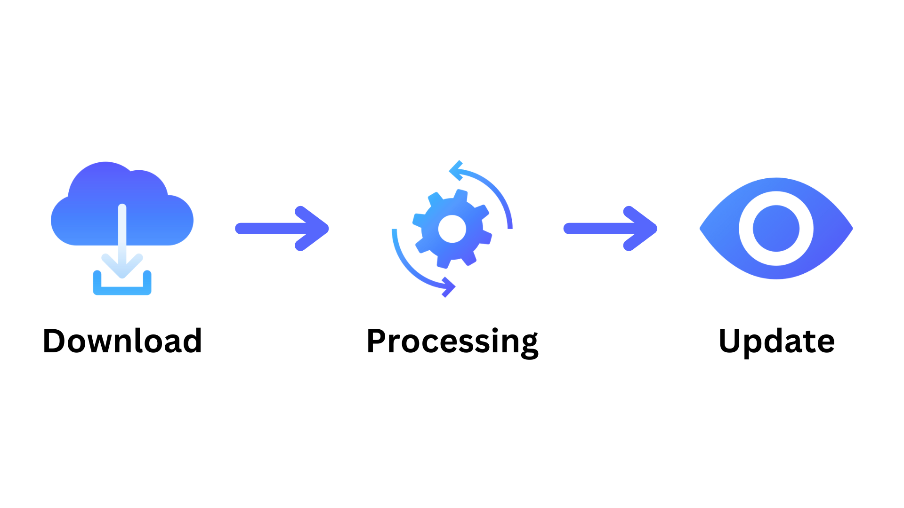
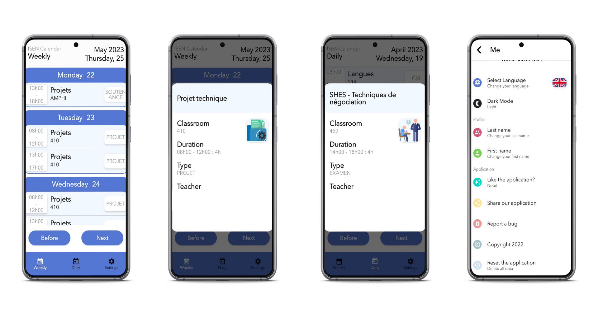
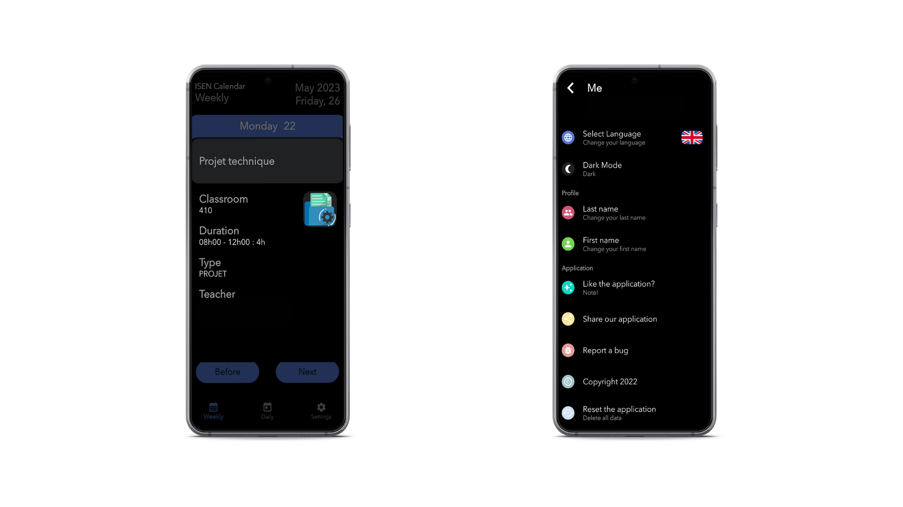

# CalendarISEN

It is an android app for engineering school : ISEN

This project was developed during my free time during my first year of engineering school.

This project was developed in Java and XML.

# Why?

I wanted to create an app on my phone that helps me every day.

It's very annoying to know when classes start with the current service:

* The website is very slow,
* You must log in to the website,
* You have to navigate the website to view the courses.

This application avoids the connection to the website and shows you when the class of the day or classes of the week open.

# How does it works?

The school website allows you to download your schedule at this address:

`https:/[ent website].isen.fr/webaurion/ICS/[firstName].[lastName].ics`

With:

* `[ent website]` the school website,
* `[firstName]` the first name of a student,
* `[lastName]` the last name of a student.

You can download the .ics file from a web browser (like Firefox,...).

The app downloads every time you open the app and updates your schedule.

# Captures

## Light theme

## Night theme

